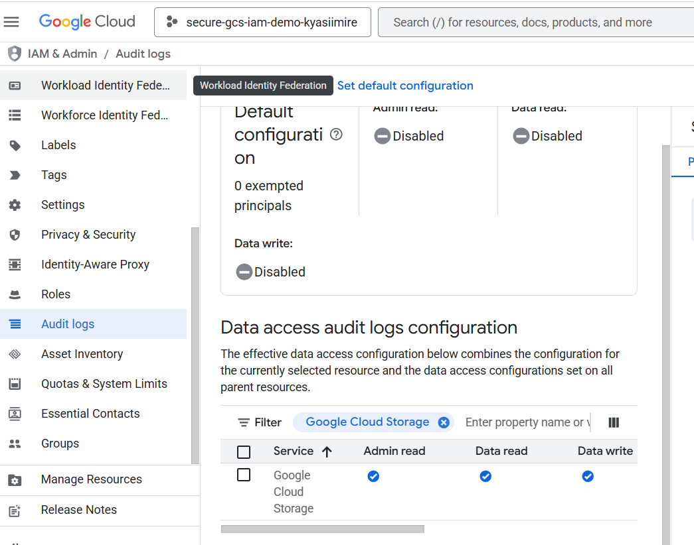
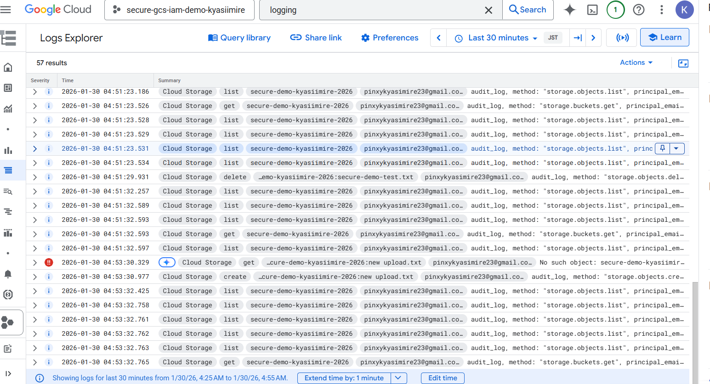
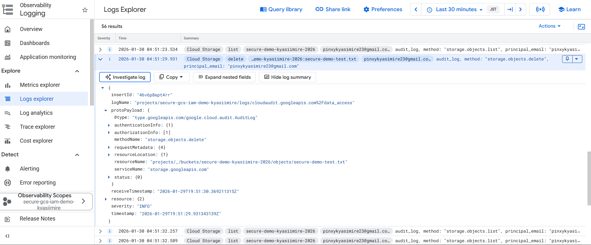
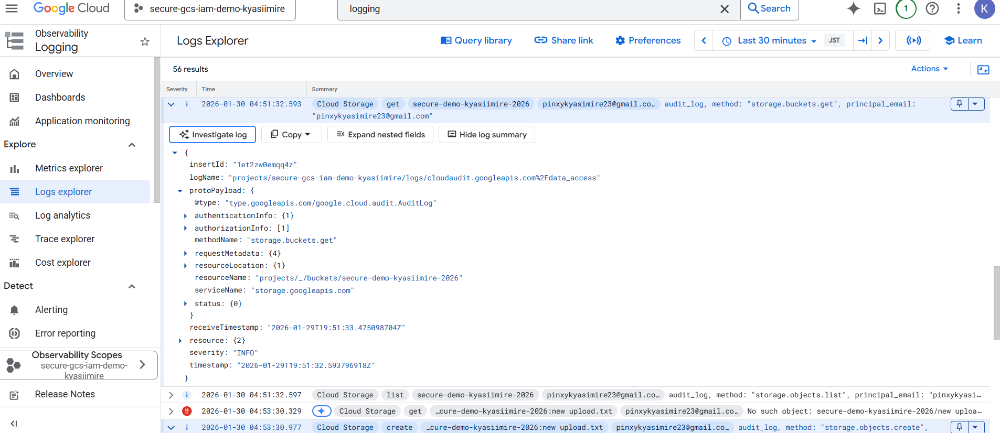
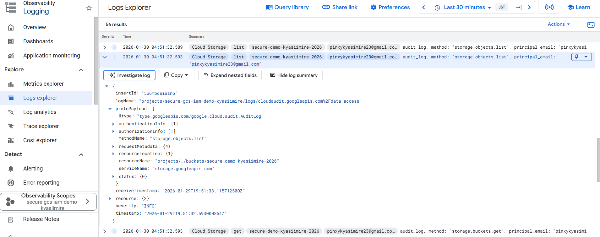

# Secure Google Cloud Storage with IAM & Audit Logs

**Beginner hands-on GCP security project** (January 2026)  
Demonstrates two core security best practices:  
- **Least-privilege IAM** configuration  
- **Enabling & verifying Data Access Audit Logs** for Cloud Storage objects

### Project Goals
- Create a secure Cloud Storage bucket (uniform access + public access prevention enforced)
- Apply minimal IAM roles (no public grants)
- Enable **Data Access** logs (which are **disabled by default**!)
- Generate real activity (upload, download, delete, list) and prove the logs capture everything

### What I Did – Step by Step
1. Created a fresh GCP project  
2. Created a bucket with **Uniform bucket-level access** and **Public access prevention enforced**  
3. Uploaded several small test files (.txt & .png)  
4. Configured IAM:  
   - Only my personal account  
   - Granted specific roles: **Storage Object Admin** + **Storage Object User**  
   - No `allUsers` or `allAuthenticatedUsers` (common insecure mistake avoided)  
5. Enabled **Cloud Audit Logs** for Cloud Storage:  
   - Checked **Admin Read**, **Data Read**, **Data Write**  
6. Generated activity:  
   - Uploaded files → `storage.objects.create`  
   - Downloaded files → `storage.objects.get`  
   - Deleted a file → `storage.objects.delete`  
   - Listed objects → `storage.objects.list`  
7. Viewed logs in **Logs Explorer**:  
   - Confirmed 50+ entries  
   - Expanded several to show methodName, principalEmail, resourceName, timestamp

### Screenshots
**IAM Policy (least privilege)**  
  

**Audit Logs enabled**  
  

**Logs Explorer overview**  
   

**Expanded log – Create (upload)**  
 

**Expanded log – Delete**  

**Expanded log – Get (download)**  

**Expanded log – List**  

| Section                          | Screenshot File                                 | What it shows                              |
|----------------------------------|-------------------------------------------------|--------------------------------------------|
| IAM configuration                | iam-policy-clean-least-privilege.png  )          | Only my account + specific Storage roles   |
| Audit Logs enabled               | audit-logs-enabled.png                          | Data Read & Data Write checked for Storage |
| Logs Explorer overview           | logs-explorer-results.png                       | 50+ results (list/get/create/delete)       |
| Expanded log – Create (upload)   | expanded-log-create.png                         | storage.objects.create details             |
| Expanded log – Delete            | expanded-log-delete.png                         | storage.objects.delete details             |
| Expanded log – Get (download)    | expanded-log-get.png                            | storage.objects.get details                |
| Expanded log – List              | expanded-log-list.png                           | storage.objects.list details               |

### Key Learnings & Best Practices
- **Public access prevention** should be enforced on every bucket — prevents accidental public exposure.
- **Uniform bucket-level access** + IAM-only control is the modern, recommended way (legacy ACLs are deprecated).
- **Data Access audit logs** are **disabled by default** to avoid high volume/cost — must be explicitly enabled for object-level monitoring.
- Logs capture **who** (principalEmail), **what** (methodName), **when** (timestamp), and **on what** (resourceName).
- Even failed attempts (e.g. "No such object") are logged — useful for detecting attacks or misconfigurations.

### Tools Used
- Google Cloud Console  
- Cloud Storage  
- IAM & Admin  
- Cloud Logging / Logs Explorer

**Open to freelance work**  
I’m actively looking for beginner/entry-level gigs:  
- Setting up secure GCS buckets  
- Configuring IAM policies  
- Enabling & verifying audit logs in GCP  
- Basic GCP security reviews / hardening

Feel free to message me here or on Upwork!  
Let’s turn this learning into real projects 

